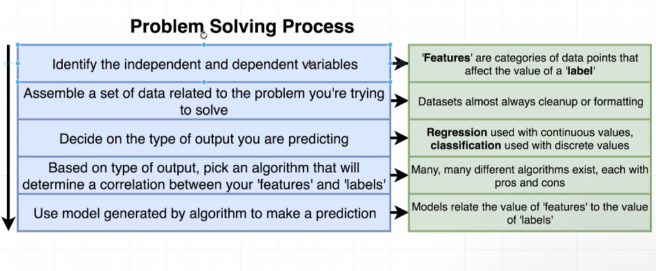

# Section 1 Notes

## Problem Solving Process

1. Identify data that is relevant to the problem.
2. Assemble a set of data related to the problem you're trying to fix.
3. Decide on the type of output you are predicting.
4. Based on the type of out,pick an algorithm that will determine a correlation between your 'features' and 'labels'.
5. Use model generated by algorithm to make a prediction.

Decided on the type of output.
Classification -> The value of our labels belongs to a discrete set. The value of our labels belong to a discrete set.

Regression -> The value of our labels belong to a continuous set. We are trying to predict the value of our sets. The value of our labels belong to a continuous set.

Problem Solving Process: 
