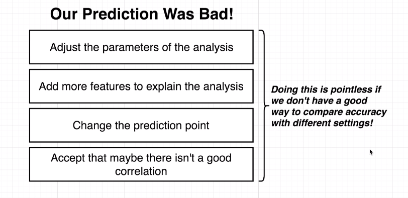

# Section 1 Notes

## Problem Solving Process

1. Identify data that is relevant to the problem.
2. Assemble a set of data related to the problem you're trying to fix.
3. Decide on the type of output you are predicting.
4. Based on the type of out,pick an algorithm that will determine a correlation between your 'features' and 'labels'.
5. Use model generated by algorithm to make a prediction.

Decided on the type of output.
Classification -> The value of our labels belongs to a discrete set. The value of our labels belong to a discrete set.

Regression -> The value of our labels belong to a continuous set. We are trying to predict the value of our sets. The value of our labels belong to a continuous set.

## Problem Solving Process:

1. Identify the data:
Game Breakdown

 Using an array to capture the data.
 
 Since the ball land in a designated buckets(labels/categories) the type of output selected will be classification.[steps 1 to 3]

4. Based on the data the algorithm selected was K-Nearest Neighbor(knn) Idiom that relates to knn is birds of a feather flock together

## K-Nearest Neighbor (KNN)

After building the first algorithm you may not see the results you want.

## Multi Dimensional KNN Algorithm

Using the Pythagorean theorem to calculate the distance between each ball.
Two feature distance calculation (bounciness and drop location). Adding the ball size will make this a three feature calculation.

End of fundamental of introduction.

## Pros and Cons of Lodash

## Pros and Cons of Tensorflow JS

Methods are very similar to Lodash making the transition from Lodash very easy.

## Tensorflow

You can find Tensorflow docs at: [Docs](https://js.tensorflow.org)

## Tensor dimensions

Dimensions in an array.

3D Tensor dimensions.

## Shape property

Row - Columns

end of 46