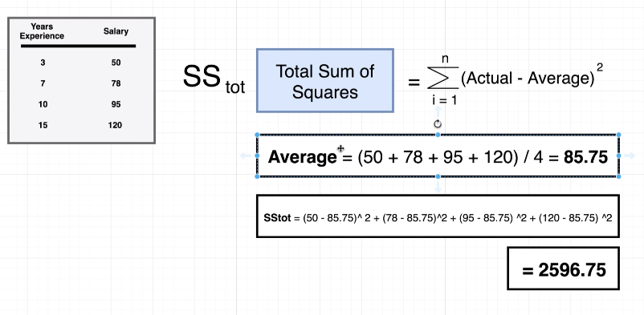
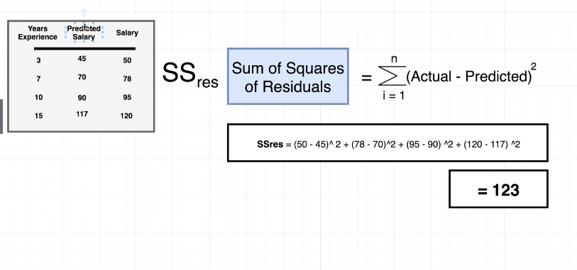
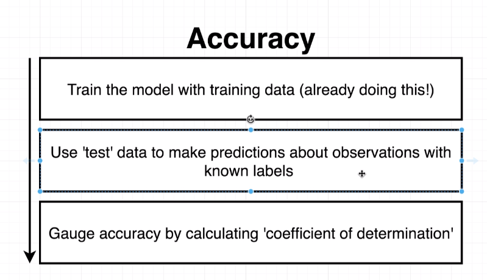

# Week 4 - Section 7 8 9

## Calculating SS TOT - SS RES

SS TOT = Total Sum of Squares

SS RES = Sum of Squares of Residuals

After calculating SS and SR we go back to calculate the Coefficient of Determinations.

## Accuracy

