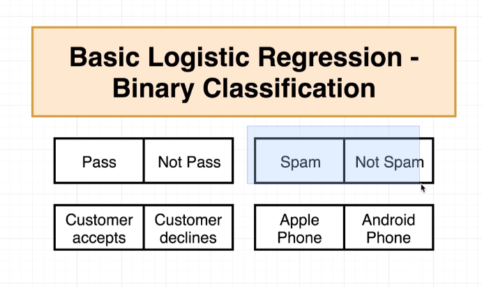
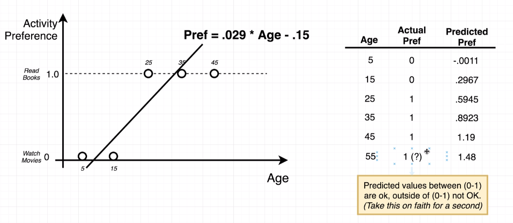

# Week 4 - Section 7 8 9

## Calculating SS TOT - SS RES

SS TOT = Total Sum of Squares


SS RES = Sum of Squares of Residuals


After calculating SS and SR we go back to calculate the Coefficient of Determinations.

## Accuracy


## Helper Function

The job of the helper function is to return a normalized or standardized data sets.


## Multi Variate Equation Update

We will now be taking displacement and weight into consideration. The initial equation only used horsepower. The equate will go from univariate (one variable/feature) to multivariate linear regression.


2x is not a multiple for the value. As shown in the image below. The 2 signify the second iteration (or result) for the feature. For example:

```bash
# alternate notation
       (2) = second iteration
x2 = x
        1 = feature
```

Even though the cart shows 1x 2x 3x they are just one iteration of data and not multiplications in the chart below.


## Batch Gradient Descent - Stochastic Gradient Descent


## Binary Classification



Basic Logistic Regression is similar to Linear Regression.

After we have categories for the results we need to encode the results. In the example below
we are encoding watching movies as 0 and reading books as 1. After selecting the encoding for the categories a formula is needed to be able to predict the results.



## Sigmoid Equation

#