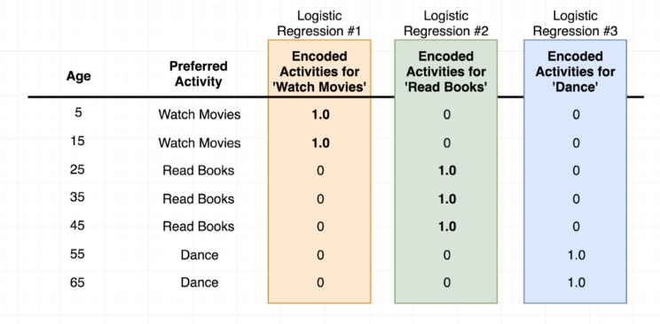
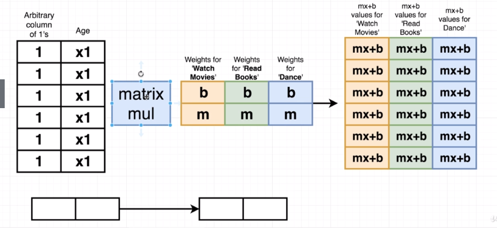
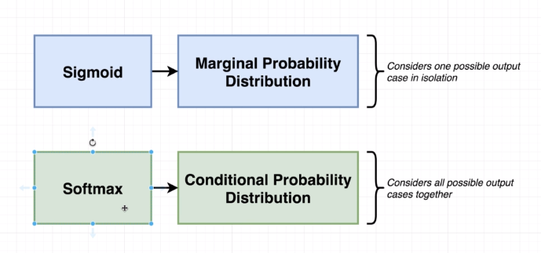
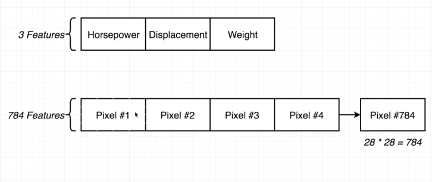

# Week 7 8 9

## Multinominal Analysis

## Combined Tensors

## Probability Distribution

Marginal Probability Distribution - Considers one possible output case in isolation.

Conditional Probability Distribution - Considers all possible output cases together.

## Features

The digit pictures are 28px by 28px = 784px which equals 784 features.

151